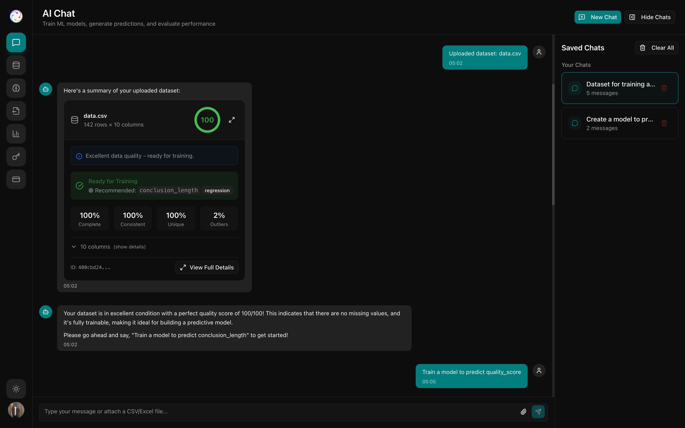

# Noosphere

Noosphere is a collective reasoning platform with a React frontend and an Express + SQLite backend. It lets users:

- create deliberation questions with deadlines
- verify contributors per question
- submit structured reasoning chains with premises, conclusion, and confidence
- watch reasoning clusters form in a live graph
- push active submissions through Storacha hot storage when configured
- score persuasion/quality with Impulse AI
- synthesize consensus with Gemini
- archive completed sessions through the Storacha/Filecoin path

## Stack

- React 19 + Vite
- Express 5 + SQLite (`better-sqlite3`)
- Tailwind CSS v4
- React Flow for the reasoning graph
- World ID React SDK for human verification
- Storacha client for hot storage uploads and archive publication
- Gemini API for synthesis
- Impulse AI inference API for quality scoring (requires deployment)

## Model Training Snapshot



## Run locally

1. Install dependencies:
   `npm install`
2. Start the backend first:
   `npm run server:start`
3. In a second terminal, start the frontend:
   `npm run client:dev`
4. Open the app in your browser:
   `http://localhost:3000`
5. Build for production:
   `npm run build`

You can also start both processes together with:

```bash
npm run dev
```

The backend listens on `http://localhost:8787` and the frontend runs on `http://localhost:3000`.
If the app looks blank or API-backed features are failing locally, make sure the backend is running first.

## Environment

The app is still usable without provider keys:

- World ID falls back to demo verification
- Storacha falls back to deterministic local CIDs
- Impulse AI falls back to local scoring heuristics until inference is configured
- Gemini falls back to local synthesis heuristics

Backend and AI envs:

```bash
PORT=8787
NOOSPHERE_ENABLE_DEMO_SEED=false
RP_SIGNING_KEY=sk_xxx
GEMINI_API_KEY=
GEMINI_MODEL=gemini-2.5-flash
IMPULSE_API_BASE_URL=https://api.impulselabs.ai
IMPULSE_INFERENCE_BASE_URL=https://inference.impulselabs.ai
IMPULSE_API_KEY=
IMPULSE_DEPLOYMENT_ID=

VITE_STORACHA_PROOF=
VITE_STORACHA_SPACE_DID=
VITE_WORLD_ID_RP_ID=rp_xxx
```

If you want to enable the client-side World ID widget, also set:

```bash
VITE_WORLD_ID_APP_ID=app_example
VITE_WORLD_ID_ACTION=noosphere-submit-reasoning
```

The app now fetches a fresh `rp_context` from the backend on demand, so you do not need to keep `VITE_WORLD_ID_RP_CONTEXT_JSON` updated manually. Ensure `RP_SIGNING_KEY` and `VITE_WORLD_ID_RP_ID` are set on the server.

Notes:

- Public/browser envs use `VITE_*`. Server secrets do not. Do not put Gemini, Impulse, or signing secrets behind `VITE_*`, because that exposes them to the browser.
- Storacha is used for hot storage and archive publication; archival reaches Filecoin through the Storacha/Filecoin pipeline when the delegation supports it.
- The backend owns question, submission, and synthesis persistence in `data/noosphere.db`.
- Predicted quality scores weight synthesis ordering and scale node size in the reasoning graph.
- API request/response payloads are logged in the browser console for tracing app activity.
- Official World ID verification still requires a signed RP context.
- The fallback path is intentional so development can continue without every provider key.

## Roadmap

See [plan.md](/Users/sam/Desktop/Projects/NooSphere/plan.md) for next steps and remaining work.

## Generate World RP Context

For local testing, you can generate a fresh `rp_context` JSON blob with:

```bash
npm run world:rp-context
```

This prints the JSON object expected by `VITE_WORLD_ID_RP_CONTEXT_JSON`. It reads `VITE_WORLD_ID_RP_ID` and `RP_SIGNING_KEY` from `.env.local` or your shell.

To refresh `.env.local` in place with a new signed context:

```bash
npm run world:refresh-env
```

Restart Vite after refreshing so the new `VITE_` value is loaded.

To validate both integrations directly:

```bash
npm run check:integrations
```
